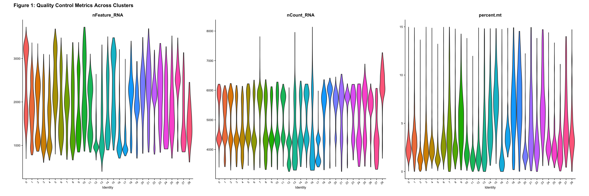
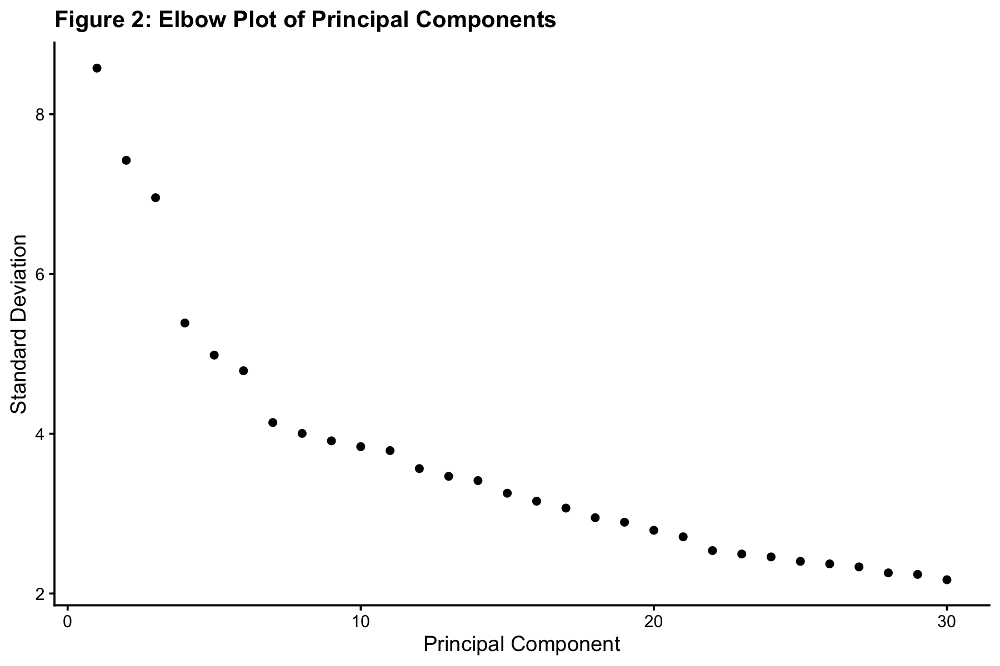
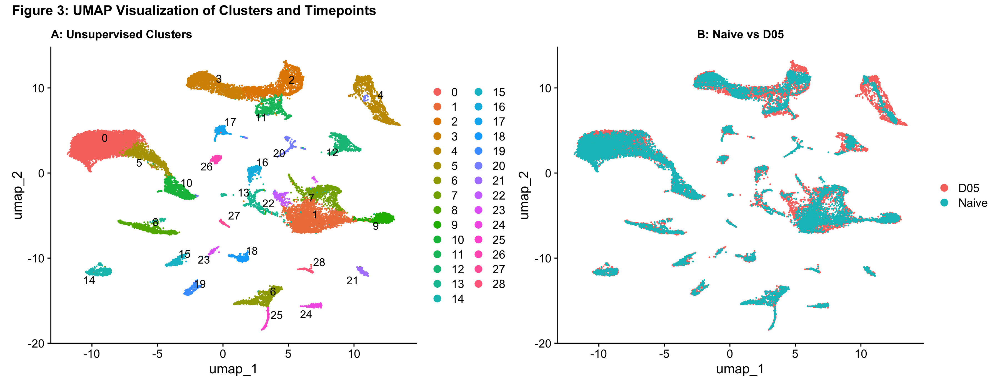
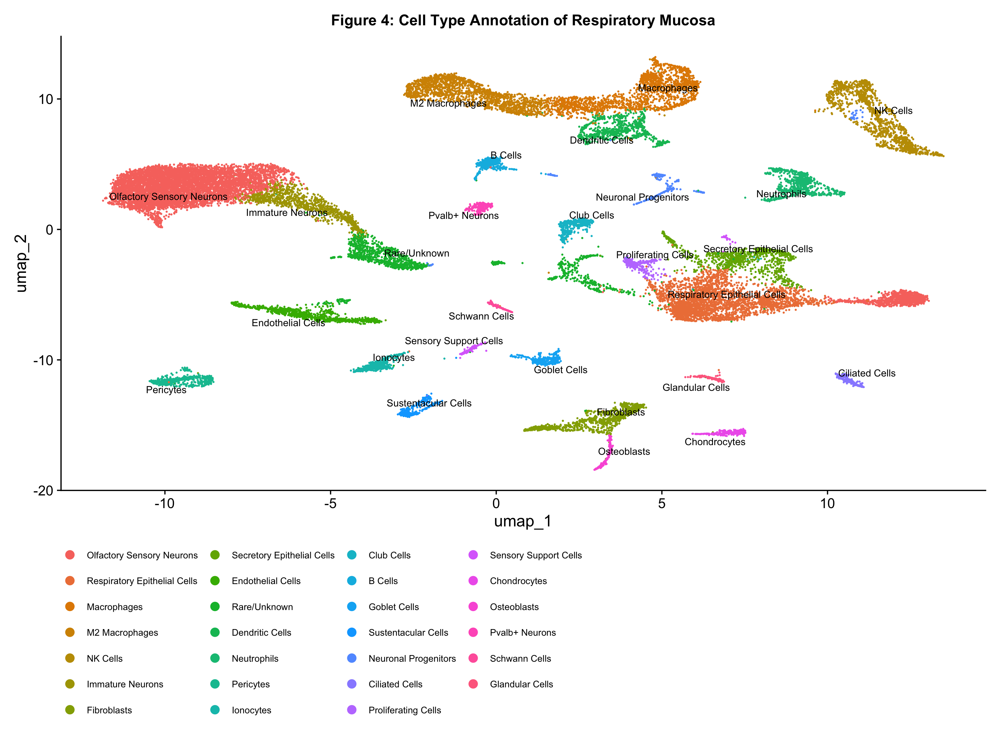
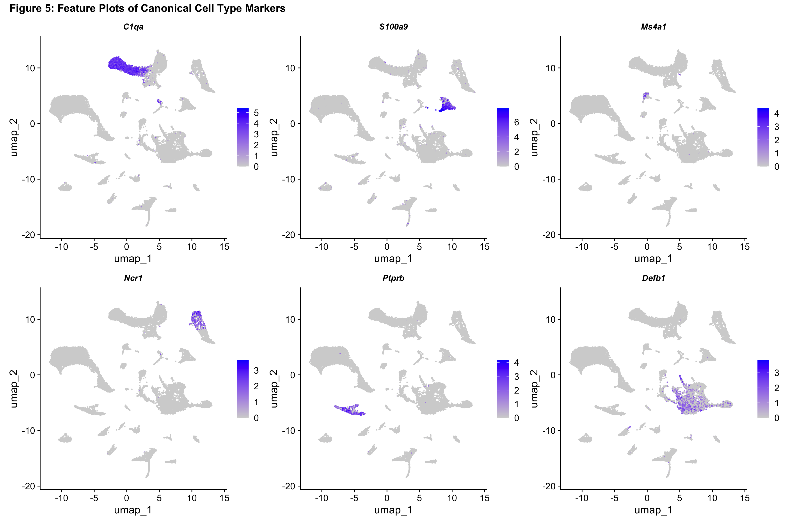
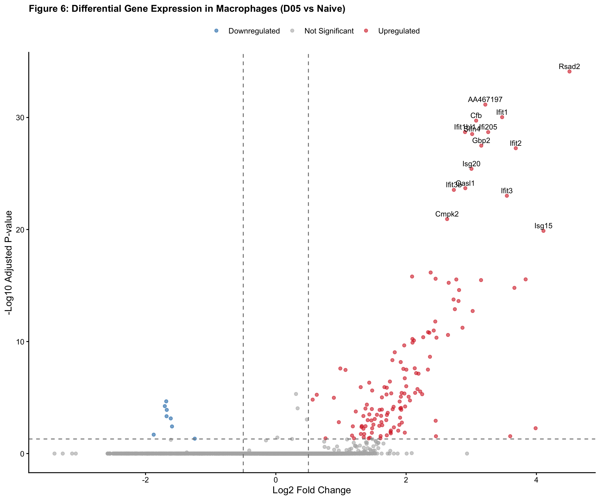
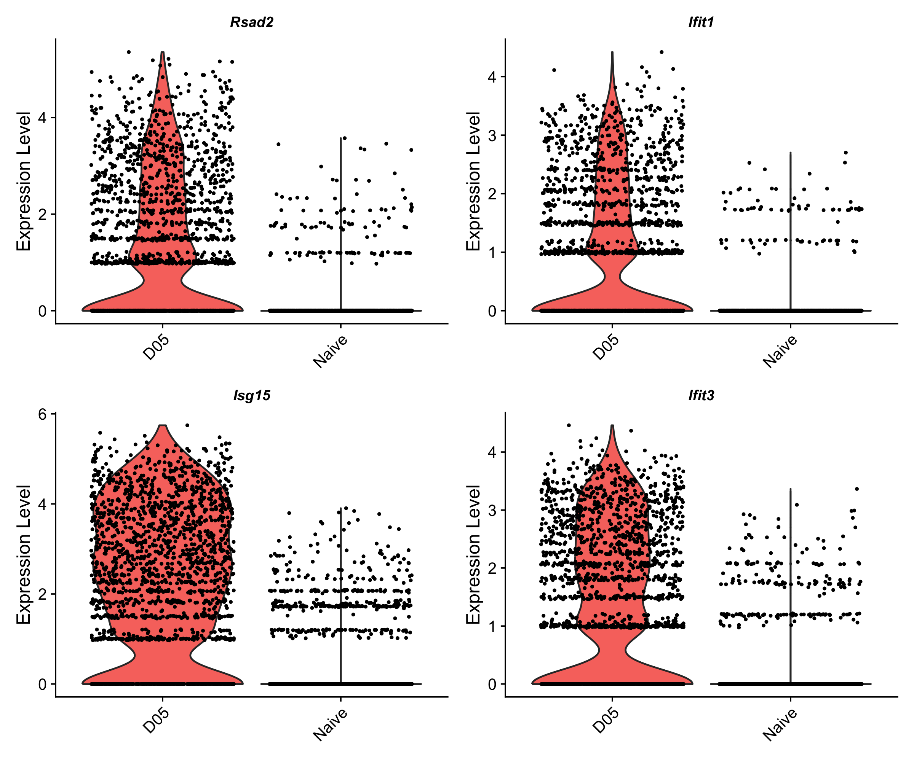
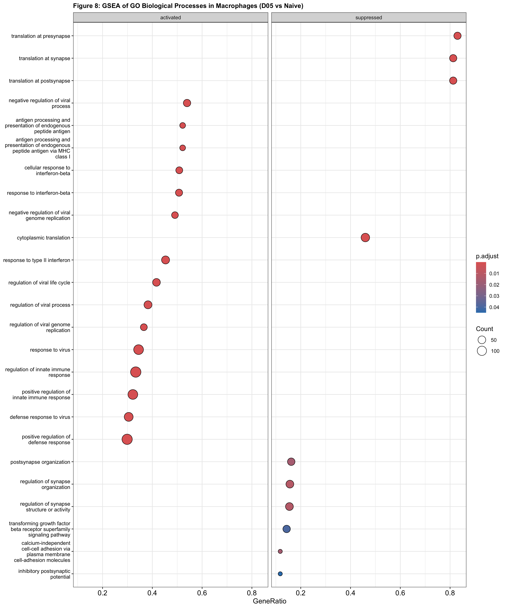

# BINF*6110 Assignment 4: scRNA-seq Analysis of IAV Nasal Mucosa

**Course:** BINF*6110 - Applied Bioinformatics   
**Dataset:** Kazer et al. 2024 - Mouse nasal mucosa scRNA-seq following IAV infection     
**BioProject:** [PMC11324402](https://pmc.ncbi.nlm.nih.gov/articles/PMC11324402/)

---

## Table of Contents
1. [Introduction](#introduction)
2. [Methods](#methods)
3. [Results](#results)
4. [Discussion](#discussion)
5. [References](#references)

---

## Introduction

Influenza A virus (IAV) is a negative-sense, single-stranded RNA virus and a major respiratory pathogen affecting both humans and animals worldwide (Krammer et al., 2018). It causes an estimated three to five million cases of severe illness each year and remains a significant public health concern due to its ability to rapidly evolve and cause pandemics (WHO, 2023). Infection begins in the nasal mucosa, which serves as the primary site of viral entry and early replication (Kazer et al., 2024). The nasal cavity contains several distinct regions, including the respiratory mucosa (RM), olfactory mucosa (OM), and lateral nasal gland (LNG), each with different cell types and roles in immune defense and viral detection (Kazer et al., 2024).

The innate immune response to IAV is triggered within hours of infection and is largely driven by immune cells in the nasal mucosa (Iwasaki & Pillai, 2014). Among these, macrophages play a key role as both early detectors of infection and regulators of the inflammatory response. These cells recognize viral components through pattern recognition receptors, which activate signaling pathways that lead to the production of type I and type II interferons, as well as interferon-stimulated genes (ISGs) (Schneider et al., 2014). This interferon response is one of the earliest and most important antiviral defenses, and both its timing and intensity can strongly influence disease outcome (Iwasaki & Pillai, 2014).

Studying how different cell types respond to IAV infection requires methods that can capture variation at the single-cell level. Bulk RNA sequencing averages gene expression across all cells in a sample, which can hide important differences between cell types and overlook rare populations (Jovic et al., 2022). In contrast, single-cell RNA sequencing (scRNA-seq) profiles gene expression in individual cells, allowing for the identification of distinct cell types, their marker genes, and how each population responds to infection (Jovic et al., 2022). This is especially useful in complex tissues like the nasal mucosa, where many different cell types coexist and respond differently to viral infection.

For analyzing scRNA-seq data, Seurat is a widely used framework that provides tools for quality control, normalization, dimensionality reduction, clustering, and visualization (Hao et al., 2021). One common challenge in these datasets is batch effects caused by technical differences between samples, which can interfere with biological interpretation (Luecken et al., 2022). Harmony is often used to address this issue by correcting batch effects in PCA space, allowing cells from different samples to be more accurately compared (Korsunsky et al., 2019). After integration and clustering, differential expression analysis is best performed using pseudobulk approaches, which group cells by sample and apply bulk RNA-seq methods such as DESeq2. This reduces false positives compared to analyzing individual cells directly (Squair et al., 2021). To interpret these results, gene set enrichment analysis (GSEA) can be used to identify biological pathways that are enriched among differentially expressed genes (Subramanian et al., 2005).

In this study, we reanalyze the dataset from Kazer et al. (2024) to examine how nasal mucosa cell populations respond to IAV infection in mice. We focus specifically on the respiratory mucosa, comparing uninfected mice to those five days post-infection, a time point associated with peak myeloid cell recruitment. Using Seurat, Harmony, and pseudobulk DESeq2, we identify 29 distinct cell populations, annotate their identities, and investigate how macrophages respond transcriptionally to infection.

---

## Methods

### Data Description

The dataset used in this study was obtained from Kazer et al. (2024), a publicly available single-cell RNA sequencing study of mouse nasal mucosa following intranasal Influenza A virus (IAV) infection. The data was provided as a pre-built Seurat object containing 156,572 cells and 25,129 gene features across three anatomical regions: the respiratory mucosa (RM), olfactory mucosa (OM), and lateral nasal gland (LNG). Cells were collected from five timepoints: naive (uninfected), and 2, 5, 8, and 14 days post-infection (dpi), with three biological replicates per timepoint. For this analysis, cells were subset to the respiratory mucosa only, retaining the naive and 5 dpi timepoints, resulting in 26,905 high-quality cells after filtering. The respiratory mucosa was selected because it is the primary site of IAV replication, and day 5 post-infection was chosen because it corresponds to the peak of myeloid cell recruitment, representing the most pronounced innate immune response across the time course (Kazer et al., 2024).

### Quality Control

Mitochondrial gene content was calculated for each cell as a percentage of total counts using the PercentageFeatureSet() function in Seurat v5, using the pattern "^mt-" to identify mouse mitochondrial genes. High mitochondrial content indicates that a cell is stressed or dying, as cytoplasmic RNA leaks out while mitochondrial transcripts remain, artificially inflating their proportion (Osorio & Cai, 2021). Cells were filtered to retain those with more than 200 detected genes, fewer than 4,000 detected genes, and less than 15% mitochondrial content. The lower gene count threshold removes empty droplets, which contain ambient RNA rather than a true cell. The upper threshold removes likely doublets, which are droplets containing two cells captured together and counted as one. The mitochondrial threshold of 15% was set based on visual inspection of violin plots showing that the vast majority of cells fell well below this value, with only a small tail of outliers above it. After filtering, 26,905 cells were retained for downstream analysis.

### Normalization and Feature Selection

Gene expression counts were log-normalized using NormalizeData() with a scale factor of 10,000. This divides each cell's counts by its total count, multiplies by 10,000, and applies a log1p transformation, correcting for differences in sequencing depth so that expression values are comparable across cells. Log normalization was chosen over SCTransform, which performs normalization, scaling, and variance stabilization in a single step using a regularized negative binomial regression model (Hafemeister & Satija, 2019). While SCTransform can improve results in datasets with large dynamic ranges in cell quality, log normalization was preferred here because the dataset was provided pre-processed with generally consistent quality metrics across cells, and log normalization is more computationally efficient and produces comparable clustering results in well-controlled datasets (Luecken et al., 2022).

The top 2,000 most variable genes were identified using FindVariableFeatures() with the default "vst" selection method, which models the mean-variance relationship across genes and selects those with the highest biological variability. These genes carry the most useful signal for distinguishing cell types and are used for all downstream dimensionality reduction. Data were then scaled using ScaleData(), which centers each gene to a mean of zero and scales it to unit variance, preventing highly expressed genes from disproportionately influencing PCA.

### Dimensionality Reduction

Principal component analysis (PCA) was performed on the scaled variable features using RunPCA() with 30 principal components. An elbow plot was generated using ElbowPlot() to assess how much variance each PC explained and to justify retaining 30 components. The standard deviation declined gradually without a sharp drop, supporting the use of all 30 PCs to capture the full range of biological variation present in this heterogeneous tissue.

UMAP was used for two-dimensional visualization of cell clusters using RunUMAP(). UMAP was chosen over t-SNE because it preserves both local and global structure in the data, meaning that not only are similar cells placed near each other, but the relative positions of clusters also reflect broader biological relationships (McInnes et al., 2018). t-SNE, by contrast, only preserves local structure and is sensitive to initialization and perplexity parameters, making it less reproducible and harder to interpret at the dataset level (Marx, 2024).

### Batch Correction

Because the dataset includes cells from multiple individual mice, batch effects arising from per-animal variability were corrected using Harmony v1.2.4 (Korsunsky et al., 2019). Harmony was run using RunHarmony() with mouse_id as the grouping variable, correcting the PCA embedding iteratively until convergence. Harmony was chosen over Seurat's CCA integration method because CCA requires splitting and re-normalizing layers before integration, is substantially more memory-intensive, and can over-correct in datasets where biological variation is confounded with sample identity (Stuart et al., 2019). Harmony instead adjusts cell embeddings directly in PCA space without modifying the underlying count data, making it faster, more memory-efficient, and less prone to over-correction (Korsunsky et al., 2019). Harmony converged after three iterations, indicating stable and consistent correction.

### Clustering

A shared nearest neighbor (SNN) graph was constructed from the Harmony-corrected embedding using FindNeighbors() with 30 dimensions. Cell clusters were identified using FindClusters() with a resolution of 0.5, which applies the Louvain community detection algorithm to the SNN graph. A resolution of 0.5 was chosen over higher values such as 0.8 or 1.0 because it produced biologically interpretable clusters without over-segmenting cell populations into artificially fine subdivisions. Higher resolutions tend to split coherent cell types into redundant subclusters, which complicates annotation without adding meaningful biological information (Luecken et al., 2022). This resulted in 29 distinct clusters across the dataset.

### Cell Type Annotation

Marker genes for each cluster were identified using FindAllMarkers() with only.pos = TRUE to restrict results to upregulated markers, a minimum expression fraction of 0.25, and a log2 fold change threshold of 0.25. These thresholds ensure that reported markers are both specific to the cluster and expressed at a biologically meaningful level. Manual annotation was chosen over automated approaches such as SingleR because manual annotation using canonical markers allows for direct biological validation of each cluster and gives greater control over ambiguous or tissue-specific cell types that may not be well-represented in reference datasets (Pasquini et al., 2021). The top three marker genes per cluster ranked by average log2 fold change were used to assign cell type identities by cross-referencing with canonical markers from PanglaoDB and nasal mucosa-specific literature including Durante et al. (2020). Feature plots were generated using FeaturePlot() to visually confirm that selected marker genes localized to their expected clusters in UMAP space.

### Differential Expression Analysis

Differential expression analysis was performed on the macrophage population, comprising clusters annotated as Macrophages and M2 Macrophages. These clusters were selected because macrophages are a central innate immune population in the nasal mucosa and are expected to show the strongest transcriptional response to IAV at day 5, which corresponds to peak myeloid recruitment (Kazer et al., 2024). Pseudobulk analysis was performed by aggregating single-cell counts within each mouse and timepoint using AggregateExpression(), producing one expression profile per biological replicate per condition. This approach was used rather than comparing individual cells directly because single-cell DE testing treats each cell as an independent observation when in reality cells from the same mouse are not biologically independent, which inflates the false positive rate and can produce significant results even between technical replicates (Squair et al., 2021). DESeq2 was applied via FindMarkers() with test.use = "DESeq2" to compare D05 against Naive macrophages. DESeq2 was chosen over edgeR because it uses empirical Bayes shrinkage to stabilize variance estimates across genes with low counts, which is particularly important when the number of replicates per group is small, as is the case here with three mice per condition (Love et al., 2014). Genes with an adjusted p-value below 0.05 and an absolute log2 fold change greater than 0.5 were considered significantly differentially expressed. Results were visualized using a volcano plot generated with ggplot2 v3.5.1, and violin plots were used to show the expression distribution of top interferon-stimulated genes across conditions.

### Gene Set Enrichment Analysis

Functional interpretation of the differential expression results was performed using GSEA on Gene Ontology Biological Process (GO BP) gene sets via clusterProfiler v4.16.0 (Wu et al., 2021). GSEA was chosen over over-representation analysis (ORA) because it uses the full ranked list of genes rather than a discrete significance cutoff, making it more sensitive to coordinated pathway-level changes that individual genes may not reach significance for on their own (Subramanian et al., 2005). ORA, by contrast, discards all non-significant genes and relies heavily on the chosen significance threshold, which can miss biologically meaningful but modestly expressed pathway members. clusterProfiler was chosen over alternatives such as fgsea or DAVID because it provides a unified interface for multiple enrichment methods, integrates directly with Bioconductor annotation databases, and is actively maintained with extensive documentation (Wu et al., 2021). Genes were ranked by average log2 fold change in descending order, with genes most upregulated in D05 macrophages at the top. Gene symbols were converted to Entrez IDs using bitr() with the org.Mm.eg.db v3.21.0 mouse annotation database. GSEA was run using gseGO() with the Biological Process ontology, retaining gene sets between 15 and 500 genes and applying a Benjamini-Hochberg adjusted p-value cutoff of 0.05. Results were visualized as a dotplot split by activation direction using dotplot() from the enrichplot package.

---

## Results

### Quality Control and Filtering

Following subsetting to the respiratory mucosa and filtering, violin plots were generated across all 29 clusters to assess the distribution of key quality control metrics (Figure 1). The number of detected genes per cell (nFeature_RNA) ranged from approximately 800 to 3,500 across most clusters, with total RNA counts (nCount_RNA) consistently between 4,000 and 6,500. Mitochondrial gene content (percent.mt) was low across all clusters, with the majority of cells falling below 5% and only a small tail of outliers approaching the 15% threshold. The consistency of these metrics across all 29 clusters confirmed that filtering successfully removed low-quality cells and that the retained cells represent high-quality, viable populations suitable for downstream analysis. After filtering, 26,905 cells were retained from the original 26,964, with only 59 cells removed, indicating that the dataset was largely pre-cleaned.

**Figure 1:** Quality Control Metrics Across Clusters. Violin plots showing the number of detected genes (nFeature_RNA), total RNA counts (nCount_RNA), and mitochondrial gene percentage (percent.mt) across all 29 clusters after filtering.

### Dimensionality Reduction and Clustering

To determine the appropriate number of principal components for downstream analysis, an elbow plot was generated for the first 30 PCs (Figure 2). Standard deviation declined steeply from PC1 (8.7) through approximately PC5 (5.3), after which the decline became more gradual and continued without a sharp inflection point through PC30 (2.2). This gradual decline without a clear elbow supported the use of all 30 PCs to ensure that the full range of biological variation across this highly heterogeneous tissue was captured. Following Harmony integration using mouse_id as the grouping variable, which converged in three iterations, cells were clustered using the Louvain algorithm at a resolution of 0.5, producing 29 distinct clusters. UMAP visualization of the numbered clusters showed clear spatial separation between populations, reflecting the diverse cell types present in the respiratory mucosa (Figure 3A). When cells were colored by timepoint, Naive and D05 cells were well-mixed within the majority of clusters, confirming that Harmony successfully corrected per-mouse batch effects and that clustering was driven by cell identity rather than condition (Figure 3B). Notably, the macrophage clusters in the upper portion of the UMAP showed a visible enrichment of D05 cells, consistent with the expected recruitment of myeloid populations at this timepoint.

**Figure 2:** Elbow Plot of Principal Components. Standard deviation across the first 30 PCs declines gradually without a sharp inflection point, supporting the use of all 30 PCs for downstream analysis.

**Figure 3:** UMAP visualization colored by cluster number (A) and timepoint (B), showing good mixing of Naive and D05 cells across most clusters following Harmony integration.

### Cell Type Annotation

To assign biological identities to the 29 clusters, marker genes were identified for each cluster using FindAllMarkers() and cross-referenced with canonical cell type markers from PanglaoDB and nasal mucosa literature (Durante et al., 2020). The annotated UMAP revealed a diverse array of 27 distinct cell populations spanning immune, epithelial, neuronal, and stromal lineages, with two clusters left as rare or unknown due to insufficient canonical marker expression (Figure 4). Immune populations identified included macrophages, M2 macrophages, neutrophils, NK cells, dendritic cells, and B cells. Epithelial populations included respiratory epithelial cells, secretory epithelial cells, goblet cells, club cells, and ciliated cells. Neuronal and support populations included olfactory sensory neurons, immature neurons, neuronal progenitors, sustentacular cells, Pvalb+ neurons, and Schwann cells. Stromal populations included fibroblasts, endothelial cells, and pericytes. Additional populations included ionocytes, sensory support cells, proliferating cells, chondrocytes, osteoblasts, and glandular cells.

To validate these annotations, feature plots were generated for six canonical marker genes (Figure 5). C1qa, a complement component expressed by macrophages, was specifically enriched in the macrophage clusters in the upper portion of the UMAP. S100a9, a calcium-binding protein highly expressed in neutrophils, showed restricted expression in a distinct cluster at approximately (5, 3) in UMAP space. Ms4a1, a B cell surface marker, localized to a small cluster in the upper-middle region of the UMAP. Ncr1, a natural cytotoxicity receptor expressed by NK cells, was confined to the NK cell cluster in the upper right. Ptprb, an endothelial marker, was restricted to the elongated endothelial cluster in the lower-left region. Defb1, a defensin expressed by respiratory epithelial cells, showed enriched expression in the respiratory epithelial cluster on the right side of the UMAP. The clear spatial restriction of all six markers to their expected clusters confirmed the biological validity of the annotations.

**Figure 4:** Annotated UMAP of the respiratory mucosa showing 27 distinct cell populations identified by manual annotation using canonical marker genes.

**Figure 5:** Feature plots showing expression of six canonical marker genes: C1qa (macrophages), S100a9 (neutrophils), Ms4a1 (B cells), Ncr1 (NK cells), Ptprb (endothelial cells), and Defb1 (respiratory epithelial cells).

### Differential Expression Analysis

To investigate the transcriptional response of macrophages to IAV infection, pseudobulk differential expression analysis was performed comparing D05 and Naive macrophages using DESeq2. The volcano plot revealed a strongly asymmetric pattern, with the vast majority of significant genes being upregulated at day 5 post-infection (Figure 6). Only approximately five to six genes were significantly downregulated, indicating that the macrophage transcriptional response at this timepoint is characterized primarily by broad antiviral activation rather than widespread suppression. The most significantly upregulated genes were almost entirely interferon-stimulated genes (ISGs), with Rsad2 showing both the highest statistical significance (padj < 10^-35) and one of the largest fold changes (log2FC = 4.51). Other highly significant ISGs included Ifit1 (log2FC = 3.47), Ifit2 (log2FC = 3.68), Ifit3 (log2FC = 3.55), Isg15 (log2FC = 4.11), Isg20, Oasl1, and Gbp2, alongside complement factor Cfb and antiviral restriction factor Slfn4.

Violin plots of the top four ISGs further confirmed their strong induction at day 5 (Figure 7). Rsad2 and Ifit1 were nearly absent in naive macrophages, with expression distributions centered close to zero, while showing broad induction in D05 macrophages with peak expression levels of approximately 5 and 4 respectively. Isg15 showed a similar pattern of strong upregulation in D05 macrophages, though a small subset of naive macrophages showed low-level baseline expression, suggesting that Isg15 has some constitutive activity even in the absence of infection. Ifit3 was similarly strongly induced at D05 and largely absent in naive cells.

**Figure 6:** Volcano plot of differential gene expression in macrophages comparing D05 vs Naive. Red points indicate significantly upregulated genes (padj < 0.05, log2FC > 0.5), blue points indicate downregulated genes. Dashed lines mark the significance and fold change thresholds.

**Figure 7:** Expression distribution of the top four interferon-stimulated genes (Rsad2, Ifit1, Isg15, Ifit3) in D05 and Naive macrophages.

### Gene Set Enrichment Analysis

GSEA on GO Biological Process gene sets revealed a clear functional distinction between pathways activated and suppressed in D05 macrophages relative to naive (Figure 8). Among activated pathways, the most significantly enriched terms included positive regulation of defense response, defense response to virus, positive regulation of innate immune response, regulation of innate immune response, response to virus, response to type II interferon, response to interferon-beta, cellular response to interferon-beta, antigen processing and presentation of endogenous peptide antigen via MHC class I, and negative regulation of viral genome replication. These results are directly consistent with the strong ISG signature observed in the DE analysis and reflect a coordinated macrophage antiviral program driven by interferon signaling downstream of viral recognition. Among suppressed pathways, the most prominently depleted terms were synaptic translation-related processes, including translation at presynapse, translation at synapse, and translation at postsynapse, which showed the highest gene ratios on the suppressed side at approximately 0.8. Additional suppressed terms included cytoplasmic translation, postsynapse organization, and regulation of synapse structure or activity. While synaptic terms are not conventionally associated with macrophage biology, their suppression likely reflects a broad downregulation of general translational machinery as macrophages redirect cellular resources toward antiviral effector programs.

**Figure 8:** Dotplot of GSEA results for GO Biological Process gene sets. Left panel shows activated pathways enriched in D05 macrophages, right panel shows suppressed pathways. Dot size reflects gene count and color reflects adjusted p-value.

---

## Discussion

The scRNA-seq analysis of the respiratory mucosa at day 5 post-IAV infection revealed a diverse cellular landscape, with 29 transcriptionally distinct clusters spanning immune, epithelial, neuronal, and stromal lineages. This level of diversity is expected given the role of the nasal mucosa in coordinating barrier defense, mucociliary clearance, and immune surveillance (Ualiyeva et al., 2021).

Both tissue-resident populations, including macrophages, endothelial cells, fibroblasts, and sustentacular cells, and recruited immune populations such as neutrophils, NK cells, and dendritic cells were identified. This reflects the cellular reorganization that occurs during early innate immune activation in the upper respiratory tract. In the UMAP, there is a clear enrichment of day 5 (D05) cells within macrophage clusters compared to naive samples. This is consistent with the expansion of myeloid populations during peak viral load, which is a well-established feature of the early response to IAV infection (Cardani et al., 2017).

This enrichment is largely restricted to the myeloid compartment and is less pronounced in epithelial or neuronal populations. This suggests that the response at day 5 is primarily immunological rather than broadly disruptive to tissue structure, which aligns with the localized nature of IAV infection in this model (Kazer et al., 2024).

The differential expression analysis of macrophages shows a transcriptional response dominated by interferon-stimulated genes (ISGs), with very few downregulated genes. This indicates that macrophages at this time point are strongly activated in an antiviral state rather than undergoing widespread transcriptional suppression.

The most strongly upregulated gene is Rsad2 (log2FC = 4.51), which encodes Viperin, a well-characterized antiviral protein that inhibits viral replication by producing a nucleotide analogue that disrupts viral RNA synthesis (Gizzi et al., 2018). This mechanism specifically targets viral polymerases without affecting host RNA, making it a highly effective antiviral response. Previous studies have shown that loss of Rsad2 leads to increased viral replication and worse outcomes in IAV infection, highlighting its importance in vivo (Tan et al., 2012). Its strong induction across D05 macrophages supports its central role at peak infection.

The coordinated upregulation of Ifit1, Ifit2, and Ifit3 represents another key component of this antiviral response. These proteins work together to recognize and bind viral RNA, preventing its translation and limiting viral replication (Fensterl & Sen, 2015). Their expression is driven by viral RNA sensing pathways and is minimal in naive macrophages, indicating that their induction is directly infection-dependent.

Isg15 is also strongly upregulated, although low baseline expression is present in a subset of naive macrophages. ISG15 modifies target proteins through ISGylation, which disrupts viral protein function and enhances interferon signaling (Shi et al., 2010). This low baseline expression likely reflects a primed immune state in tissue-resident macrophages, which is then amplified during active infection.

Additional upregulated genes, including Gbp2 and Oasl1, further highlight the breadth of the antiviral response. Gbp2 contributes to restricting viral replication, while Oasl1 enhances viral RNA sensing pathways, reinforcing the interferon response (MacMicking, 2012; Zhu et al., 2014). The upregulation of complement factor Cfb also suggests activation of complement-mediated mechanisms that support clearance of infected cells.

Gene set enrichment analysis (GSEA) provides broader context for these gene-level changes. One of the most notable findings is the enrichment of antigen processing and presentation via MHC class I. This suggests that by day 5, macrophages are beginning to transition from purely innate functions toward roles that support the activation of adaptive immunity (Yewdell & Hill, 2002). This timing is consistent with the progression of IAV infection, where antigen presentation precedes peak T cell responses (Iwasaki & Pillai, 2014).

At the same time, pathways related to viral restriction and regulation of the viral life cycle are enriched, indicating that macrophages are deploying multiple antiviral strategies simultaneously. These mechanisms act at different stages of infection, from viral entry to replication and release, highlighting the coordinated nature of the antiviral response.

Interestingly, several pathways related to synaptic and cytoplasmic translation are downregulated in D05 macrophages. Although these terms are typically associated with neuronal processes, they also reflect general aspects of protein synthesis. Their suppression suggests a shift away from normal cellular functions toward prioritizing antiviral activity.

This is consistent with known metabolic reprogramming in activated immune cells, where energy and resources are redirected toward the production of antiviral proteins and cytokines (O'Neill & Pearce, 2016). The additional suppression of cytoplasmic translation further supports this idea, suggesting that macrophages reduce overall protein synthesis while selectively maintaining translation of interferon-responsive genes.

Overall, these results provide a clear picture of the macrophage response to IAV infection at day 5. The strong and coordinated upregulation of key antiviral genes, combined with pathway-level enrichment of interferon signaling, viral restriction, and antigen presentation, shows that macrophages mount a multi-layered defense during peak viral load. At the same time, the suppression of general translational programs reflects the metabolic cost of this response, with cells prioritizing antiviral activity over normal functions. Together, these findings are consistent with established models of IAV infection, while also providing a more detailed, cell-type-specific view of the macrophage response at single-cell resolution.

---

## References

Cardani, A., Boulton, A., Kim, T. S., & Braciale, T. J. (2017). Alveolar macrophages prevent lethal influenza pneumonia by inhibiting infection of type-1 alveolar epithelial cells. *PLOS Pathogens*, 13(1), e1006140. https://doi.org/10.1371/journal.ppat.1006140

Durante, M. A., Kurtenbach, S., Sargi, Z. B., Harbour, J. W., Choi, R., Kurtenbach, S., Goss, G. M., Matsunami, H., & Goldstein, B. J. (2020). Single-cell analysis of olfactory neurogenesis and differentiation in adult humans. *Nature Neuroscience*, 23(3), 323–326. https://doi.org/10.1038/s41593-020-0587-9

Fensterl, V., & Sen, G. C. (2015). Interferon-induced Ifit proteins: Their role in viral pathogenesis. *Journal of Virology*, 89(5), 2462–2468. https://doi.org/10.1128/JVI.02744-14

Gizzi, A. S., Grove, T. L., Arnold, J. J., Jose, J., Jangra, R. K., Garforth, S. J., Du, Q., Cahill, S. M., Dulyaninova, N. G., Love, J. D., Chandran, K., Bresnick, A. R., Cameron, C. E., & Almo, S. C. (2018). A naturally occurring antiviral ribonucleotide encoded by the human genome. *Nature*, 558(7711), 610–614. https://doi.org/10.1038/s41586-018-0238-4

Hafemeister, C., & Satija, R. (2019). Normalization and variance stabilization of single-cell RNA-seq data using regularized negative binomial regression. *Genome Biology*, 20(1), 296. https://doi.org/10.1186/s13059-019-1874-1

Hao, Y., Hao, S., Andersen-Nissen, E., Mauck, W. M., Zheng, S., Butler, A., Lee, M. J., Wilk, A. J., Darby, C., Zager, M., Hoffman, P., Stoeckius, M., Papalexi, E., Mimitou, E. P., Jain, J., Srivastava, A., Stuart, T., Fleming, L. M., Yeung, B., … Satija, R. (2021). Integrated analysis of multimodal single-cell data. *Cell*, 184(13), 3573–3587. https://doi.org/10.1016/j.cell.2021.04.048

Iwasaki, A., & Pillai, P. S. (2014). Innate immunity to influenza virus infection. *Nature Reviews Immunology*, 14(5), 315–328. https://doi.org/10.1038/nri3665

Jovic, D., Liang, X., Zeng, H., Lin, L., Xu, F., & Luo, Y. (2022). Single-cell RNA sequencing technologies and applications: A brief overview. *Clinical and Translational Medicine*, 12(3), e694. https://doi.org/10.1002/ctm2.694

Kazer, S. W., Matysiak Match, C., Langan, E. M., Messou, M.-A., LaSalle, T. J., O'Leary, E., Marbourg, J., Naughton, K., von Andrian, U. H., & Ordovas-Montanes, J. (2024). Primary nasal influenza infection rewires tissue-scale memory response dynamics. *Nature*, 630, 990–998. https://doi.org/10.1038/s41586-024-07742-4

Korsunsky, I., Millard, N., Fan, J., Slowikowski, K., Zhang, F., Wei, K., Baglaenko, Y., Brenner, M., Loh, P. R., & Raychaudhuri, S. (2019). Fast, sensitive and accurate integration of single-cell data with Harmony. *Nature Methods*, 16(12), 1289–1296. https://doi.org/10.1038/s41592-019-0619-0

Krammer, F., Smith, G. J. D., Fouchier, R. A. M., Peiris, M., Kedzierska, K., Doherty, P. C., Palese, P., Shaw, M. L., Treanor, J., Webster, R. G., & García-Sastre, A. (2018). Influenza. *Nature Reviews Disease Primers*, 4(1), 3. https://doi.org/10.1038/s41572-018-0001-2

Love, M. I., Huber, W., & Anders, S. (2014). Moderated estimation of fold change and dispersion for RNA-seq data with DESeq2. *Genome Biology*, 15(12), 550. https://doi.org/10.1186/s13059-014-0550-8

Luecken, M. D., Büttner, M., Chaichoompu, K., Danese, A., Interlandi, M., Mueller, M. F., Strobl, D. C., Zappia, L., Dugas, M., Colomé-Tatché, M., & Theis, F. J. (2022). Benchmarking atlas-level data integration in single-cell genomics. *Nature Methods*, 19(1), 41–50. https://doi.org/10.1038/s41592-021-01336-8

MacMicking, J. D. (2012). Interferon-inducible effector mechanisms in cell-autonomous immunity. *Nature Reviews Immunology*, 12(5), 367–382. https://doi.org/10.1038/nri3210

Marx, V. (2024). Method of the year: Single-cell long-read sequencing. *Nature Methods*, 20(1), 1–6. https://doi.org/10.1038/s41592-023-02098-9

McInnes, L., Healy, J., & Melville, J. (2018). UMAP: Uniform manifold approximation and projection for dimension reduction. *arXiv preprint arXiv:1802.03426*. https://doi.org/10.48550/arXiv.1802.03426

O'Neill, L. A. J., & Pearce, E. J. (2016). Immunometabolism governs dendritic cell and macrophage function. *Journal of Experimental Medicine*, 213(1), 15–23. https://doi.org/10.1084/jem.20151570

Osorio, D., & Cai, J. J. (2021). Systematic determination of the mitochondrial proportion in human and mice tissues for single-cell RNA-sequencing data quality control. *Bioinformatics*, 37(7), 963–967. https://doi.org/10.1093/bioinformatics/btaa751

Pasquini, G., Rojo Arias, J. E., Schäfer, P., & Busskamp, V. (2021). Automated methods for cell type annotation on scRNA-seq data. *Computational and Structural Biotechnology Journal*, 19, 961–969. https://doi.org/10.1016/j.csbj.2021.01.015

Schneider, W. M., Chevillotte, M. D., & Rice, C. M. (2014). Interferon-stimulated genes: A complex web of host defenses. *Annual Review of Immunology*, 32, 513–545. https://doi.org/10.1146/annurev-immunol-032713-120231

Shi, H.-X., Yang, K., Liu, X., Liu, X.-Y., Wei, B., Shan, Y.-F., Zhu, L.-H., & Wang, C. (2010). Positive regulation of interferon regulatory factor 3 activation by Herc5 via ISG15 modification. *Molecular and Cellular Biology*, 30(10), 2424–2436. https://doi.org/10.1128/MCB.01466-09

Squair, J. W., Gautier, M., Kathe, C., Anderson, M. A., James, N. D., Hutson, T. H., Hudelle, R., Qaiser, T., Matson, K. J. E., Barraud, Q., Levine, A. J., La Manno, G., Skinnider, M. A., & Courtine, G. (2021). Confronting false discoveries in single-cell differential expression. *Nature Communications*, 12(1), 5692. https://doi.org/10.1038/s41467-021-25960-2

Stuart, T., Butler, A., Hoffman, P., Hafemeister, C., Papalexi, E., Mauck, W. M., Hao, Y., Stoeckius, M., Smibert, P., & Satija, R. (2019). Comprehensive integration of single-cell data. *Cell*, 177(7), 1888–1902. https://doi.org/10.1016/j.cell.2019.05.031

Subramanian, A., Tamayo, P., Mootha, V. K., Mukherjee, S., Ebert, B. L., Gillette, M. A., Paulovich, A., Pomeroy, S. L., Golub, T. R., Lander, E. S., & Mesirov, J. P. (2005). Gene set enrichment analysis: A knowledge-based approach for interpreting genome-wide expression profiles. *Proceedings of the National Academy of Sciences*, 102(43), 15545–15550. https://doi.org/10.1073/pnas.0506580102

Tan, K. S., Olfat, F., Phoon, M. C., Hsu, J. P., Howe, J. L., Thumboo, J., & Chow, V. T. (2012). In vivo and in vitro studies on the antiviral activities of viperin against influenza H1N1 and H3N2 virus infection. *Journal of General Virology*, 93(6), 1269–1277. https://doi.org/10.1099/vir.0.040824-0

Ualiyeva, S., Hallen, N., Kanaoka, Y., Ledderose, C., Matsumoto, I., Junger, W., Barrett, N. A., & Bankova, L. G. (2021). Airway brush cells generate cysteinyl leukotrienes through the ATP sensor P2Y2. *Science Immunology*, 5(43), eaax7224. https://doi.org/10.1126/sciimmunol.aax7224

WHO. (2023). *Influenza (seasonal)*. World Health Organization. https://www.who.int/news-room/fact-sheets/detail/influenza-(seasonal)

Wu, T., Hu, E., Xu, S., Chen, M., Guo, P., Dai, Z., Feng, T., Zhou, L., Tang, W., Zhan, L., Fu, X., Liu, S., Bo, X., & Yu, G. (2021). clusterProfiler 4.0: A universal enrichment tool for interpreting omics data. *Innovation*, 2(3), 100141. https://doi.org/10.1016/j.xinn.2021.100141

Yewdell, J. W., & Hill, A. B. (2002). Viral interference with antigen presentation. *Nature Immunology*, 3(11), 1019–1025. https://doi.org/10.1038/ni1102-1019

Zhu, J., Zhang, Y., Ghosh, A., Cuevas, R. A., Forero, A., Dhar, J., Ibsen, M. S., Schmid-Burgk, J. L., Schmidt, T., Ganapathiraju, M. K., Fujita, T., Hartmann, R., Barik, S., Hornung, V., Coyne, C. B., & Sarkar, S. N. (2014). Antiviral activity of human OASL protein is mediated by enhancing signaling of the RIG-I RNA sensor. *Immunity*, 40(6), 936–948. https://doi.org/10.1016/j.immuni.2014.05.007
